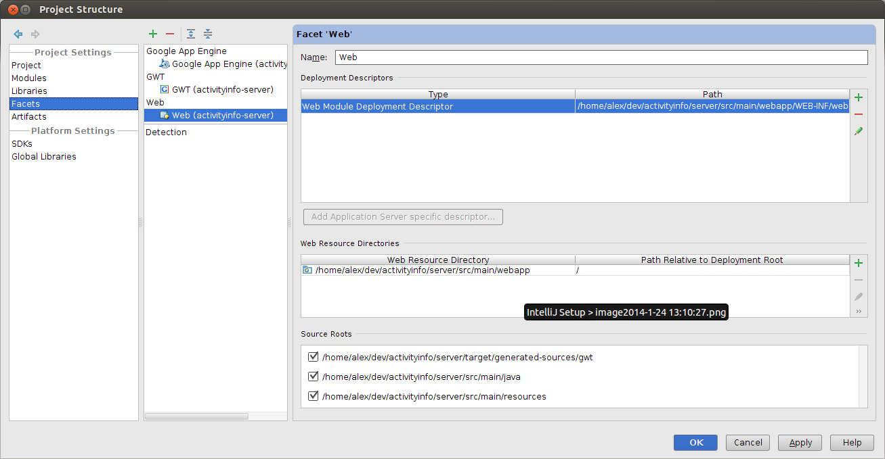
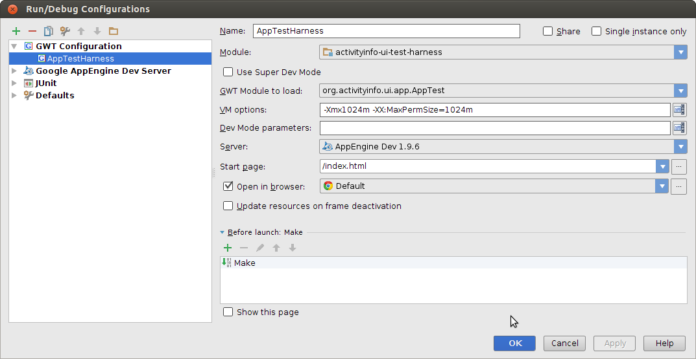

# Setting up IntelliJ

Tested on IntelliJ Ultimate 13.0+

## Import the Project

Import the root pom.xml as a project

## Setup Project Facets

### Web

### AppEngine

### GWT

Ensure that all modules are unchecked! Otherwise it will try to compile every time you launch the Run.

## Artifacts

## Setting up the Run Configuration

AI includes a 'activityinfo-ui-test-harness' module in ui/test-harness that provides a simplified 
server setup to facilitate developing locally.

* From the "Run Menu" choose "Edit Configurations".
* From the left hand panel, choose "GWT Configuration" and click the "plus" symbol to create a new configuration.

